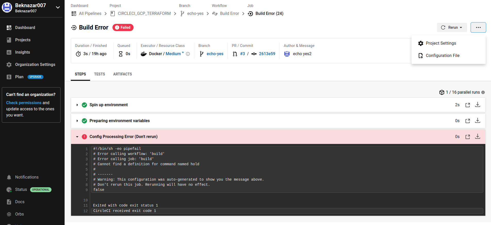
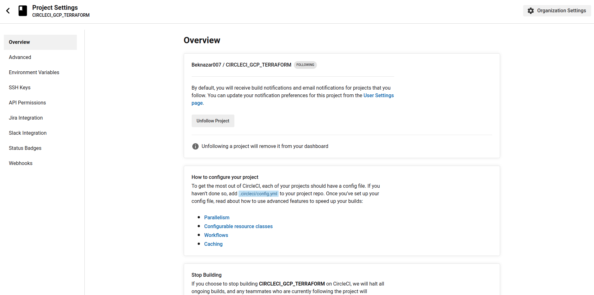
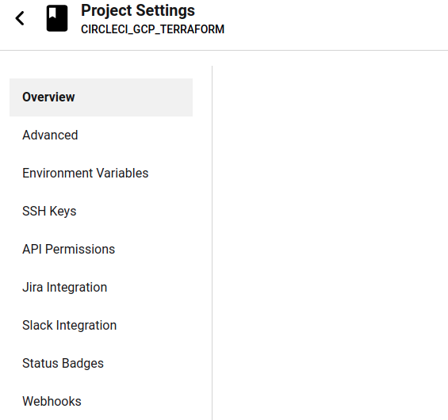
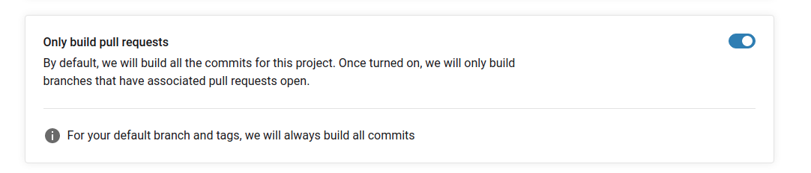
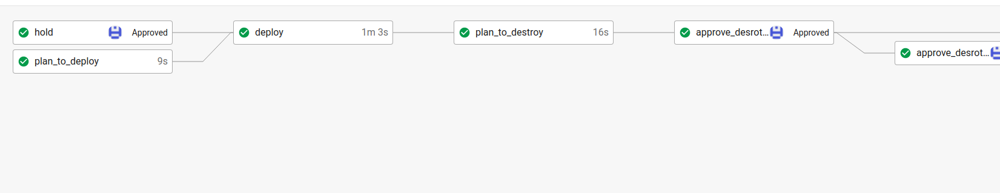
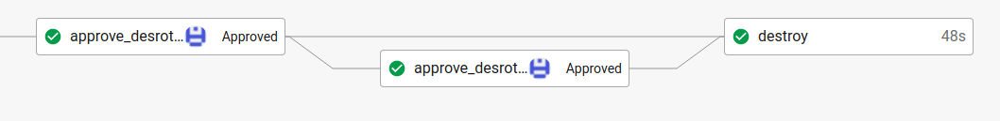

# There are 2 parts
1. Take Credentials file
2. Add to CircleCI Context
3. Create bucket in GCP
4. Go to the main.tf and specify your bucket name  
# GCP configuration 
>If you  have credentials file you can add to Context in CircleCI 
>In **IAM & ADMIN** click **Service Accounts** and add new account . configure there some parts and create new key which contains all credentials to log in .

# Cofigure In CIRCLECI

>we have to click three dotes and click **Project Settings**

>click **Organization Settings**

>Here click context , add  and create new variable. To the vars we have to put **GOOGLE_CREDENTIALS**  from credentials file which is in the **name_of_file_from_GCP.json**

>This is for giving **only pull request** to do it we have to click **Advanced** and there turn on next configuration

>After this configuration we have to change some of the file and and push to new branch and pull request new branch with master branch and then our code will work fully. 

 

# Adding CircleCI 

> I have added Circleci for this project with the same logic as Nurmukhammed does.
1. Adding credentials to the Circleci Context and take it from there.(this was Beki's GCP creds )

        
1. Creating Google storage for **.tfstate** file to safe our spin up info about terraform file

        terraform {
            backend "gcs" {
              bucket = "name_of_bucket"
              prefix = "terraform/"
            }  
1. In circleci we have to put context after workflow and than it will work.
        
        workflows: 
          build:
            jobs:
              - build:
                  context: GOOGLE_CREDENTIALS 
              - Attention When you will approve:
                  type: approval 
                  requires:
                    - build
              - build2:
                  context: GOOGLE_CREDENTIALS
                  requires: 
                    - Attention When you will approve.
                    - build
# Adding destroy part to the circleci
>1. Firstly we have to plan our **mian.tf** to know what kind of actions it will do. Job to plan this in CircleCI
        
        plan_to_deploy:
          working_directory: /terraform
          docker: 
            - image: hashicorp/terraform  
          steps:
            - checkout 
            - run:
                name: "init"
                command: terraform init
            - run:
                name: "plan"
                command: terraform plan   -input=false 

>2. Job to **deploy** to GCP

      deploy:
        working_directory: /terraform
        docker: 
          - image: hashicorp/terraform  

        steps:
          - checkout 
          - run:
              name: "init"
              command: terraform init

          - run:
              name: "apply"
              command: terraform apply --auto-approve 
            
>3. Job to  **plan to destroy** 

        plan_to_destroy:
          docker:
            - image: hashicorp/terraform:latest
          working_directory: /terraform
          steps:
            - checkout
            - run:
                name: Init
                command: terraform init -input=false
            - run:
                name: Plan
                command: terraform plan -destroy -input=false -out=tfplan -no-color
            - run:
                name: Render plan for PR comment
                command: terraform show -no-color tfplan > tfplan.txt
            - persist_to_workspace:
                root: /terraform
                paths:
                  - . 
>here we have to specify working directory **working_directory: /terraform/state** and persist our **tfplan** to the root: **/terraform/state**
>4. aplly destroy file

      destroy:
        docker:
          - image: hashicorp/terraform:latest
        working_directory: /terraform
        steps:
          - attach_workspace:
              at: /terraform
          - run:
              name: destroy
              command: terraform apply tfplan

            
>5. Workflow for project

    workflows:
      version: 2
      plan_pr:
        jobs:
          - plan_to_deploy:
              context: GOOGLE_CREDENTIALS 
          
          - hold:
              type:  approval
          
          - deploy:
              context: GOOGLE_CREDENTIALS 
              requires:
                - plan_to_deploy
                - hold
          
          - plan_to_destroy:
              context: GOOGLE_CREDENTIALS
              requires:
                - deploy
          
          - approve_to_destroy1:
              type:  approval
              requires:
                - plan_to_destroy
          - are_you_shure_to_destroy:
              type:  approval
              requires:
                - approve_to_destroy1
       
      
          - destroy:
              context: GOOGLE_CREDENTIALS 
              requires:
            
                - approve_to_destroy1
                - are_you_shure_to_destroy
>view from Cirlceci application

> If you want to destoy you have to approve 2 approval part and it will destroy                

