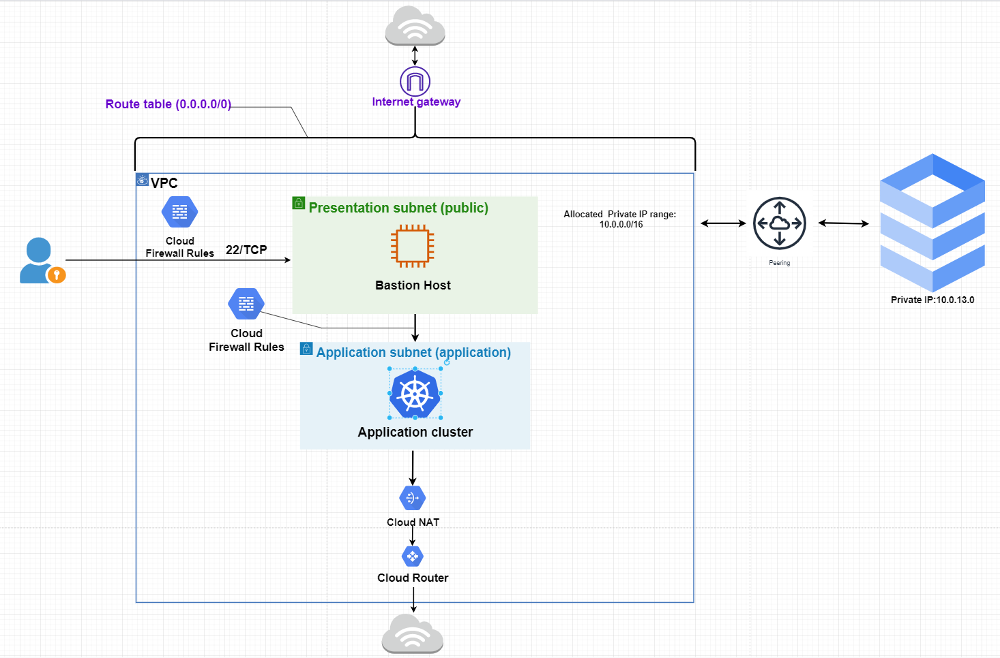

# Terraform GCP GKE-clusters with Bastion Host

## This codes create:

1. ### Two private gke-clusters with `node_pool`:
    - _Application cluster_
    - _Database cluster_
2. ### Bastion Host with Identity aware proxy (IAP) for a secure access.
3. ### Cloud SQL (PostgreSQL) database.

## **Diagram**


## **Usage**
Then perform the following commands on the root folder:
- `terraform init` terraform initialization
- `terraform plan` to see the infrastructure plan
- `terraform apply` to apply infrastructure build
- `terraform output` to see the outputs
- `terraform destroy` to destroy the build infrastructure

```terraform
terraform {
  # backend "gcs" {
  #   bucket = ""
  #   prefix = ""
  # }
  required_providers {
    google = {
      source  = "hashicorp/google"
      version = "3.53.0"
    }
  }
}

provider "google-beta" {
  credentials = file(var.credentials_file_path)
  project     = var.project_id
}

provider "google" {
  credentials = file(var.credentials_file_path)

  project = var.project_id
  region  = var.region
  zone    = var.main_zone
}

module "google_kubernetes_cluster_app" {
  source = "./gke_application"
  machine_type = "n2-standard-4"
  service_account = "" #module.bastion.service_account
  gke_version                = var.gke_version
  location                   = "us-central1-a"
  network                    = "vpc"
  subnet_name                = "application-subnet"
  ip_range_pods              = local.cluster_pods_ip_cidr_range
  ip_range_services          = local.cluster_services_ip_cidr_range
  master_ipv4_cidr_block     = local.cluster_master_ip_cidr_range
  authorized_ipv4_cidr_block = "${module.bastion.ip}/32"
  tags                       = ["application"]
  resource_labels            = {}
}

module "bastion" {
  source = "./bastion"

  user_data_path = file("C:/Users/Ant/OneDrive/Рабочий стол/gke-cluster/user_data.sh")
  region       = var.region
  project_id   = var.project_id
  zone         = var.main_zone
  bastion_name = "app-cluster"
  vpc_name     = "vpc"
  subnet_name  = "presentation-subnet"
}

module "database" {
  source = "./database"

  project_id = var.project_id
  sql_instance_size          = "db-f1-micro"
  sql_disk_type              = "PD_SSD"
  sql_disk_size              = 10
  sql_require_ssl            = false
  sql_connect_retry_interval = 60
  sql_user                   = "admin"
  sql_pass                   = "password"

  vpc_id = "projects/${var.project_id}/global/networks/vpc" # <<== VPC ID
}

```

## **Cheking connection to PostgreSQL:**
1. Download the Cloud SQL Auth proxy with commands:
   +  `wget https://dl.google.com/cloudsql/cloud_sql_proxy.linux.amd64 -O cloud_sql_proxy`
   +  `chmod +x cloud_sql_proxy`
2. Start the Cloud SQL Auth proxy:
   + `./cloud_sql_proxy -instances=INSTANCE_CONNECTION_NAME=tcp:5432`
3. Connect with another CLI:
   + `psql "host=127.0.0.1 sslmode=disable dbname=DB_NAME user=USERNAME"`
  